# 🧩 Raspberry Pi Cluster Automation

A fully automated infrastructure for a four-node Raspberry Pi cluster that handles
everything from **NVMe flashing** and **PXE boot configuration** to **K3s
deployment**, **GlusterFS storage**, and **Prometheus + Grafana monitoring**.

---

## 📸 Cluster Overview


This setup combines high-speed NVMe storage, an AI accelerator, distributed SSD
bricks, and an LTE failover node — all interconnected through a Gigabit Ethernet
switch and orchestrated by automated Ansible playbooks.

---

## 🧭 1. Introduction

The goal of this project is to build a **self-provisioning Raspberry Pi cluster**
capable of:

- Booting worker nodes directly from images flashed on an NVMe SSD (PXE/NFS).
- Managing distributed storage through GlusterFS.
- Running lightweight Kubernetes (K3s) for container workloads.
- Providing system monitoring and alerting through Prometheus and Grafana.
- Maintaining automated network routing with LTE failover redundancy.

Automation is achieved using modular Ansible roles that can bring the cluster
from bare-metal to a fully operational, monitored Kubernetes environment.

---

## ⚙️ 2. Hardware Setup

| Node | Model | Role / Function | IP Address | Storage | Peripherals |
|------|--------|----------------|-------------|----------|--------------|
| **node0** | Raspberry Pi 5 (8 GB) | Control node, PXE/NFS server, NVMe storage | `192.168.100.10` | NVMe SSD (16 partitions A/B for all nodes) | PoE+ HAT w/ fan |
| **node1** | Raspberry Pi 5 (8 GB) | AI workloads / K3s worker | `192.168.100.11` | NVMe partition (A/B boot via PXE) | Hailo AI accelerator (M.2) |
| **node2** | Raspberry Pi 4 (8 GB) | GlusterFS brick + K3s worker | `192.168.100.12` | External SSD (USB 3.0) | PoE HAT |
| **node3** | Raspberry Pi 4 (8 GB) | GlusterFS brick + Network failover (LTE) | `192.168.100.13` | External SSD (USB 3.0) | Sixfab LTE modem (USB), Phat Stack HAT |

**Network Gateway:** `192.168.100.1`  
**Switch:** Gigabit PoE + Ethernet Switch (5 ports)

Power is supplied via **PoE+** on Pi 5s and 5 V USB on Pi 4s.  
All nodes are on the same LAN subnet, with node3 capable of policy-based routing
for LTE failover.

---

## 🌐 3. Network Topology

```mermaid
flowchart LR
  GW[Router 192.168.100.1] --> SW[Ethernet Switch]
  SW --> N0[node0 – Control / NVMe]
  SW --> N1[node1 – AI Worker]
  SW --> N2[node2 – Storage]
  SW --> N3[node3 – Failover LTE]
  N3 --> LTE[Sixfab LTE Modem]
```



- **Primary gateway:** via router `192.168.100.1`
- **Backup gateway:** LTE modem on node3 (`eth1`)
- **Failover logic:** Policy-based routing (wired = priority 100, LTE = priority 200)

---

## 🧰 4. Software Architecture

| Layer | Component | Description |
|-------|------------|-------------|
| **Provisioning** | `nvme_provision` | Creates partitions, flashes OS images, updates `cmdline.txt` and `fstab`. |
| **Network Boot** | `pxe_boot` | Configures dnsmasq + TFTP + NFS exports for PXE boot of worker nodes. |
| **Access Control** | `ssh_config` | Generates SSH keys, pushes them via sshpass, populates known_hosts. |
| **System Config** | `system_config` | Hostname, hosts file, packages, and dist-upgrade. |
| **Networking** | `network_setup` | NAT, routing tables, LTE failover on node3. |
| **Storage** | `glusterfs_install` | Creates distributed volume between node2 and node3. |
| **Container Runtime** | `docker_install` | Installs Docker CE, adds users to group, enables service. |
| **Orchestration** | `k3s_install` | Installs K3s control plane and joins workers. |
| **Monitoring** | `monitoring_install` | Deploys Prometheus + Grafana via Helm. |
| **Custom Metrics** | `cpu_temp_mon_kube` | Publishes temperature metrics through Node Exporter. |
| **Maintenance** | `cluster_shutdown` | Sequential shutdown (workers → control). |

---

## 🪜 5. Playbook Execution Order

| Step | Playbook | Description |
|------|-----------|-------------|
| 1️⃣ | `nvme_provision.yml` | Partition and prepare NVMe drive on node0. |
| 2️⃣ | `image_flash.yml` | Flash OS images for each node (A/B partitions). |
| 3️⃣ | `pxe_boot.yml` | Configure PXE boot server and NFS exports. |
| 4️⃣ | `ssh_config.yml` | Generate/push SSH keys, update known_hosts. |
| 5️⃣ | `system_config.yml` | Apply system baseline (hostnames, packages). |
| 6️⃣ | `network_setup.yml` | Configure routing, NAT, LTE failover. |
| 7️⃣ | `docker_install.yml` | Install Docker on all nodes. |
| 8️⃣ | `glusterfs_install.yml` | Setup Gluster volume (node2 + node3). |
| 9️⃣ | `k3s_install.yml` | Install K3s control + workers. |
| 🔟 | `monitoring_install.yml` | Deploy Prometheus + Grafana via Helm. |
| 11️⃣ | `cpu_temp_mon_kube.yml` | Add custom temperature exporter. |
| 12️⃣ | `cluster_shutdown.yml` | Graceful shutdown sequence. |

---

## 📈 6. Monitoring and Observability

After deployment:

- **Prometheus** scrapes Node Exporter metrics and custom temperature collectors.
- **Grafana** runs on `node0` accessible via `http://192.168.100.10:3000` (default login `admin` / `admin`).

---

## 🧱 7. Repository Layout

```
rpi-cluster-automation/
├── playbooks/
├── roles/
└── inventories/
```

---

## 🧩 8. Future Enhancements

- Integrate **Hailo AI accelerator** workloads in K3s.  
- Expand **NAS** with dynamic Gluster volume management.  
- Add **Telegram/MQTT** boot failure alerts.  
- Implement **tryboot A/B** OS updates.  

---

## 🧰 9. Development Tools

`ansible-lint`, `yamllint`, `molecule`, `ansible-vault`.

---

## 📦 10. Required Collections

```yaml
collections:
  - name: community.general
  - name: ansible.posix
  - name: kubernetes.core
  - name: gluster.gluster
```

---

## 🧑‍💻 Maintainer

**Author:** Ovidiu  
**Location:** Romania  
**Last Update:** November 2025  
