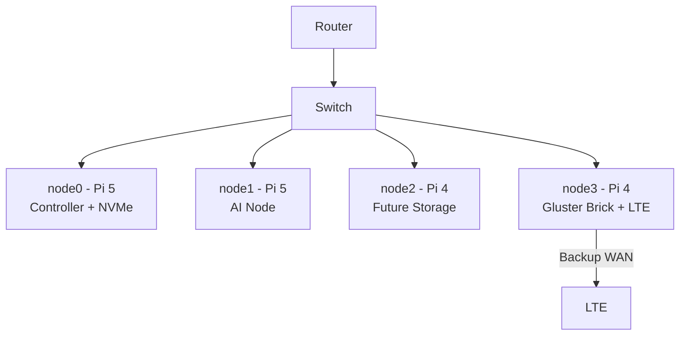

# Architecture Overview

This document describes the Raspberry Pi Cluster Automation Framework.

## Cluster Topology

> 📎 Fallback image if Mermaid is not rendered:

## Data Flows
- Control plane on node0
- Storage via GlusterFS volume
- K3s agents on all nodes
