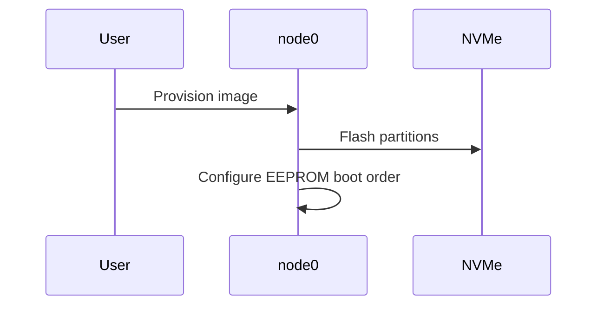

# Boot Pipeline

- SD bootstrap → NVMe
- PXE/TFTP optional
- tryboot for A/B

```mermaid
sequenceDiagram
  participant User
  participant node0
  participant NVMe
  User->>node0: Provision image
  node0->>NVMe: Flash partitions
  node0->>node0: Configure EEPROM boot order
```

