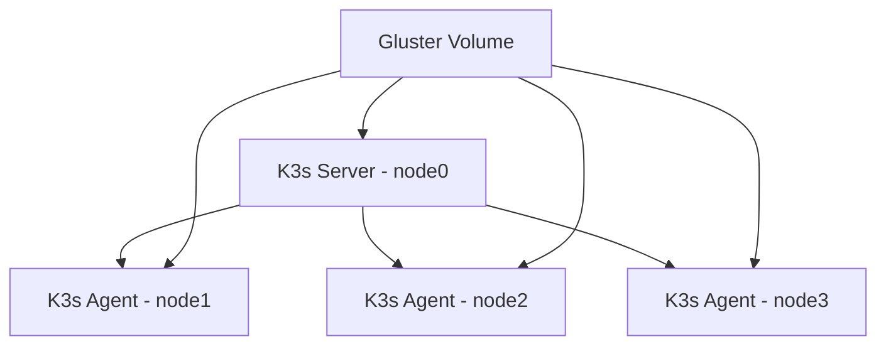

# Kubernetes (K3s)

- K3s server on node0
- Agents on node1..node3
- Gluster volume mounted on nodes

```mermaid
graph TD
  S[K3s Server - node0] --> N1[K3s Agent - node1]
  S --> N2[K3s Agent - node2]
  S --> N3[K3s Agent - node3]
  G[Gluster Volume] --> S
  G --> N1
  G --> N2
  G --> N3
```

