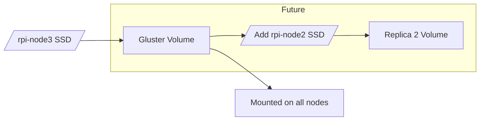

# Storage (GlusterFS)

Current: single-brick on rpi-node3. Future: replica when new SSDs are added.

```mermaid
flowchart LR
  Brick[/rpi-node3 SSD/]
  Brick --> Vol[Gluster Volume]
  Vol --> Nodes[Mounted on all nodes]

  subgraph Future
    Vol --> Brick2[/Add rpi-node2 SSD/]
    Brick2 --> Rep2[Replica 2 Volume]
  end
```

