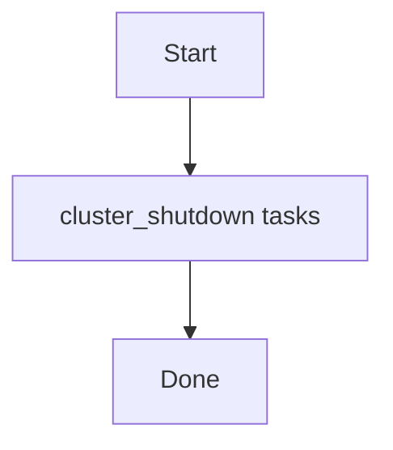

# Role: cluster_shutdown

**Purpose:** Short description of what `cluster_shutdown` does.

## Usage
```bash
ansible-playbook -i inventories/production playbooks/cluster_shutdown.yml
```

## Variables (defaults)
See `roles/cluster_shutdown/defaults/main.yml` (if present).

## Flow


