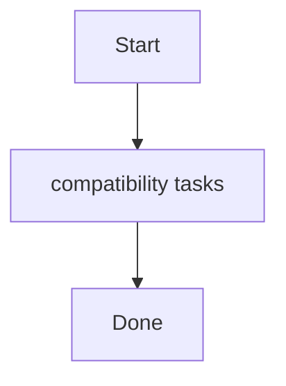

# Role: compatibility

**Purpose:** Short description of what `compatibility` does.

## Usage
```bash
ansible-playbook -i inventories/production playbooks/compatibility.yml
```

## Variables (defaults)
See `roles/compatibility/defaults/main.yml` (if present).

## Flow


