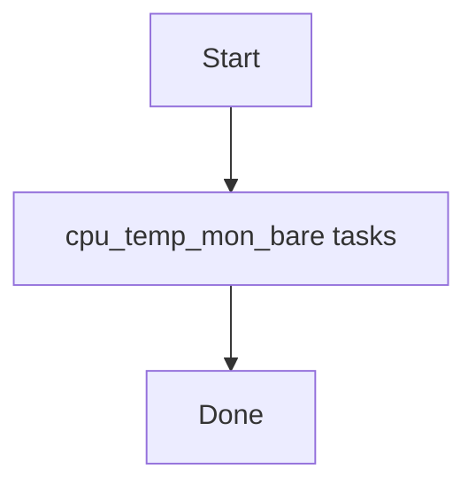

# Role: cpu_temp_mon_bare

**Purpose:** Short description of what `cpu_temp_mon_bare` does.

## Usage
```bash
ansible-playbook -i inventories/production playbooks/cpu_temp_mon_bare.yml
```

## Variables (defaults)
See `roles/cpu_temp_mon_bare/defaults/main.yml` (if present).

## Flow


