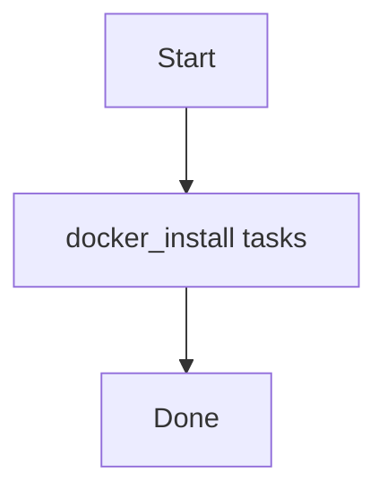

# Role: docker_install

**Purpose:** Short description of what `docker_install` does.

## Usage
```bash
ansible-playbook -i inventories/production playbooks/docker_install.yml
```

## Variables (defaults)
See `roles/docker_install/defaults/main.yml` (if present).

## Flow


