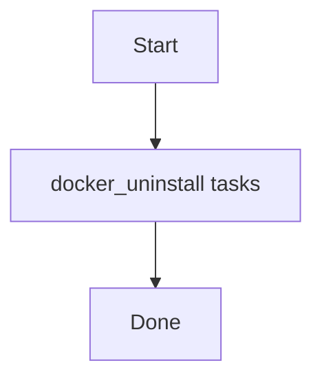

# Role: docker_uninstall

**Purpose:** Short description of what `docker_uninstall` does.

## Usage
```bash
ansible-playbook -i inventories/production playbooks/docker_uninstall.yml
```

## Variables (defaults)
See `roles/docker_uninstall/defaults/main.yml` (if present).

## Flow


