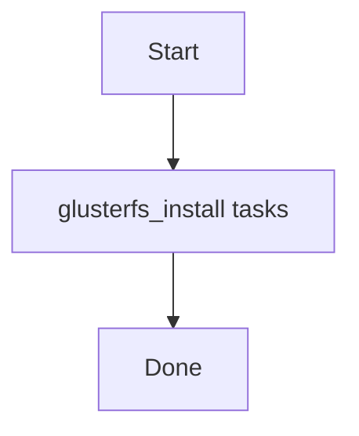

# Role: glusterfs_install

**Purpose:** Short description of what `glusterfs_install` does.

## Usage
```bash
ansible-playbook -i inventories/production playbooks/glusterfs_install.yml
```

## Variables (defaults)
See `roles/glusterfs_install/defaults/main.yml` (if present).

## Flow


