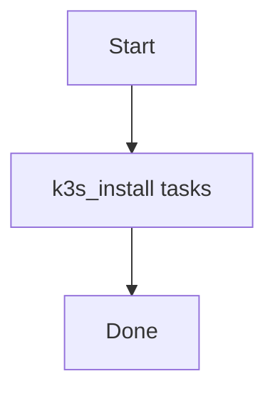

# Role: k3s_install

**Purpose:** Short description of what `k3s_install` does.

## Usage
```bash
ansible-playbook -i inventories/production playbooks/k3s_install.yml
```

## Variables (defaults)
See `roles/k3s_install/defaults/main.yml` (if present).

## Flow


