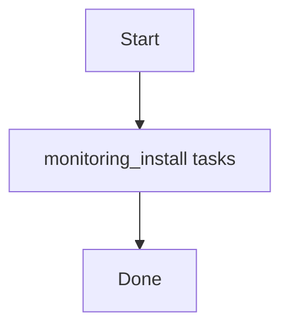

# Role: monitoring_install

**Purpose:** Short description of what `monitoring_install` does.

## Usage
```bash
ansible-playbook -i inventories/production playbooks/monitoring_install.yml
```

## Variables (defaults)
See `roles/monitoring_install/defaults/main.yml` (if present).

## Flow


