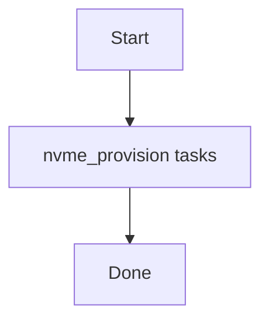

# Role: nvme_provision

**Purpose:** Short description of what `nvme_provision` does.

## Usage
```bash
ansible-playbook -i inventories/production playbooks/nvme_provision.yml
```

## Variables (defaults)
See `roles/nvme_provision/defaults/main.yml` (if present).

## Flow


