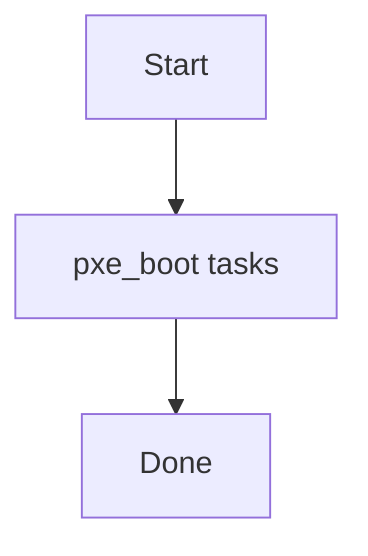

# Role: pxe_boot

**Purpose:** Short description of what `pxe_boot` does.

## Usage
```bash
ansible-playbook -i inventories/production playbooks/pxe_boot.yml
```

## Variables (defaults)
See `roles/pxe_boot/defaults/main.yml` (if present).

## Flow


