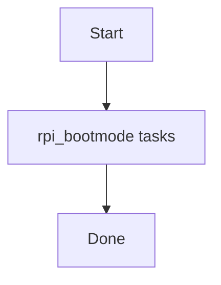

# Role: rpi_bootmode

**Purpose:** Short description of what `rpi_bootmode` does.

## Usage
```bash
ansible-playbook -i inventories/production playbooks/rpi_bootmode.yml
```

## Variables (defaults)
See `roles/rpi_bootmode/defaults/main.yml` (if present).

## Flow


