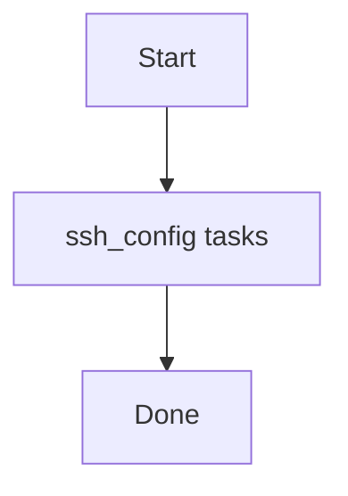

# Role: ssh_config

**Purpose:** Short description of what `ssh_config` does.

## Usage
```bash
ansible-playbook -i inventories/production playbooks/ssh_config.yml
```

## Variables (defaults)
See `roles/ssh_config/defaults/main.yml` (if present).

## Flow


