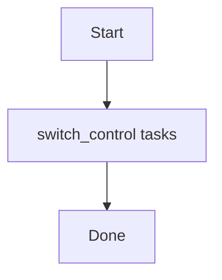

# Role: switch_control

**Purpose:** Short description of what `switch_control` does.

## Usage
```bash
ansible-playbook -i inventories/production playbooks/switch_control.yml
```

## Variables (defaults)
See `roles/switch_control/defaults/main.yml` (if present).

## Flow


