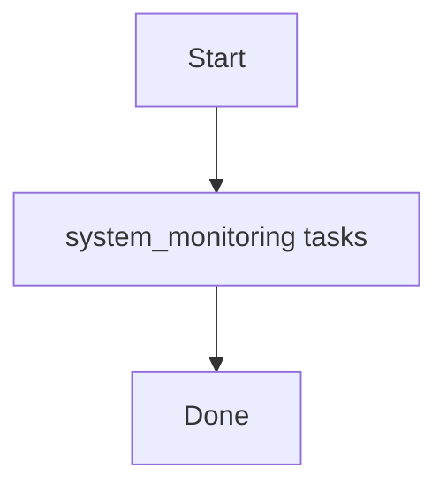

# Role: system_monitoring

**Purpose:** Short description of what `system_monitoring` does.

## Usage
```bash
ansible-playbook -i inventories/production playbooks/system_monitoring.yml
```

## Variables (defaults)
See `roles/system_monitoring/defaults/main.yml` (if present).

## Flow


